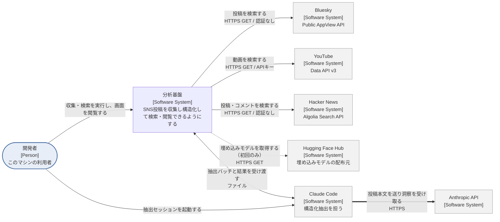
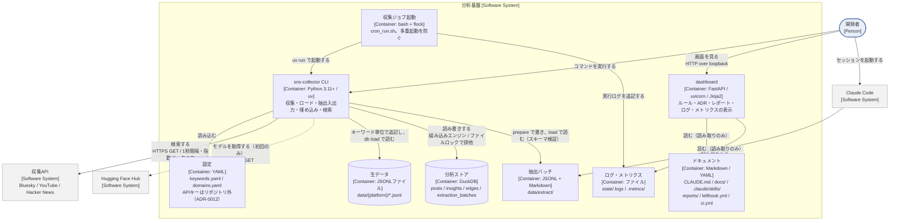
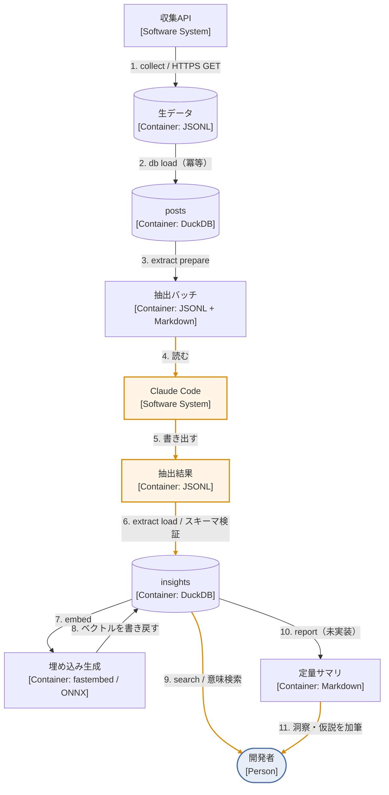
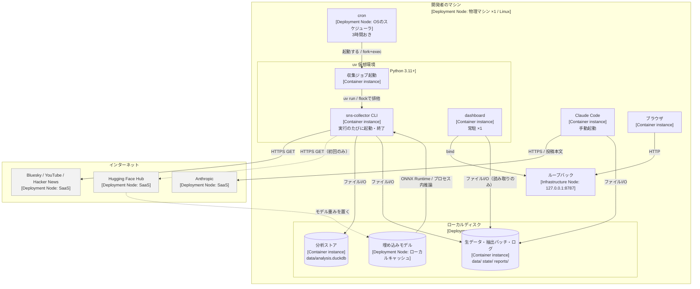

# システム構成

最終更新: 2026-08-08

関連: [design.md](./design.md) / [requirements.md](./requirements.md) / [roadmap.md](./roadmap.md) / [isolation.md](./isolation.md) / [adr/](./adr/)

---

## 0. この文書の範囲

C4モデルで記述する。コアの図を2枚、補足図を2枚置く。

| 図 | C4での位置づけ | 答える問い |
|---|---|---|
| §1 System context | Level 1 | 誰が使い、外部のどのシステムと繋がるか |
| §2 Container | Level 2 | 中は何で構成され、どのプロトコルで通信するか |
| §3 Dynamic | 補足図 | どの順に動き、どこまで無人で回るか |
| §4 Deployment | 補足図 | どのハードウェアの上で動くか |

**Level 3（Component）と Level 4（Code）は作らない。** モジュール分割は `sns-collector/src/sns_collector/` のディレクトリ構造と各 `CLAUDE.md` が示しており、図にすると実装との乖離が増えるだけになる。C4は必要なレベルだけを描くことを許している。

テーブル定義・コマンドの引数・処理の詳細は [design.md](./design.md) にある。同じことを2箇所に書かない。

図中の `[...]` はC4の要素種別（Person / Software System / Container / Deployment Node / Infrastructure Node）と技術を表す。

図はMermaidで書いてある。GitHub上では図として描画されるが、**モニタリング画面（`task dashboard`）ではコードブロックのまま表示される** — 画面は外部CDNもJSも持たない方針であり（`dashboard/CLAUDE.md`）、この文書のために例外を作っていない。

---

## 1. Level 1 — System context diagram

Claude Code はこのマシン上で動くが、C4のLevel 1では**自分たちが作っていないシステム**として外部に置く。どこで動くかは配置の話であり、§4のDeployment図が扱う。

### 外部システム

| 外部システム | 用途 | プロトコル | 認証 | 送信する内容 |
|---|---|---|---|---|
| Bluesky Public AppView API | 投稿検索 | HTTPS GET | 不要 | 検索キーワード |
| YouTube Data API v3 | 動画検索 | HTTPS GET | APIキー（`YOUTUBE_API_KEY`。置き場所はADR-0012） | 検索キーワード |
| Hacker News（Algolia Search） | 投稿・コメント検索 | HTTPS GET | 不要 | 検索キーワード |
| Hugging Face Hub | 埋め込みモデルの取得 | HTTPS GET | 不要 | なし（モデル名のみ） |
| Anthropic API | 構造化抽出 | HTTPS（Claude Code経由） | Claude Codeの認証 | **投稿本文** |

エンドポイントの実体は `adapter/source/bluesky/client.py` / `adapter/source/youtube/client.py` / `adapter/source/hackernews/client.py` の `SEARCH_URL` にある。

### 外部へ出るものの線引き

**投稿本文が外部へ出る経路はAnthropic APIの1本だけで、それは開発者が手動でセッションを開いたときにしか通らない。** 収集APIへ送るのは検索キーワードだけであり、埋め込み生成はローカルモデルで完結する（ADR-0002）。パイプラインのコードはLLM APIを呼ばない（ADR-0003）。

ADR-0002が「オフラインで完結する」と述べているのは推論のことである。fastembedは初回実行時にモデル重みをHugging Face Hubから取得してローカルへキャッシュするため、**その1回だけは外向きの通信が発生する**。キャッシュ後は通信しない。この通信に投稿本文は乗らない。

---

## 2. Level 2 — Container diagram

### コンテナ

| コンテナ | 技術 | 責務 |
|---|---|---|
| 収集ジョブ起動 | bash / flock | 収集の起動と多重起動の防止。起動元のcronは§4 |
| `sns-collector` CLI | Python 3.11+ / uv | 収集・DBロード・抽出バッチ入出力・埋め込み・検索 |
| `dashboard` | FastAPI / uvicorn / Jinja2 | 開発ルール・ADR・レポート・収集ログ・メトリクスの表示 |
| 分析ストア | DuckDB（組み込み） | 重複判定の唯一の根拠（ADR-0004） |
| 生データ | JSONLファイル | 一次データ。DBはここから再構築できる（F-04） |
| 抽出バッチ | JSONL + Markdown | Claude Codeとの受け渡し境界（ADR-0003） |

C4のコンテナは「動いている必要があるもの」を指し、Dockerコンテナのことではない。データストア・ファイルシステム・シェルスクリプトはいずれも公式に例示されているコンテナである。

### プロセス境界とロック

**収集ジョブはプラットフォームをまたいで1つのロックを共有する。** DuckDBはプロセス間で排他ロックを取るため、bluesky・youtube・hackernewsの実行時刻が重なると後発がHTTP通信の前に落ちる。理由と実装は `sns-collector/scripts/cron_run.sh` の冒頭コメントにある。

`dashboard` と `sns-collector` は同じディスクを見るが、**`dashboard` は分析ストアを開かない。** 読むのはMarkdown・YAML・ログ・メトリクスであり、`docs/` `.claude/skills/` `sns-collector/reports/` `sns-collector/state/.logs/` `.metrics/` に加えて、ルート直下の `CLAUDE.md` と各領域の `*/CLAUDE.md`、`lefthook.yml`、`.github/workflows/ci.yml` を含む。

読み取り先の定義は `dashboard/src/dashboard/paths.py` の `Roots` にあるが、**`Roots.repo` はリポジトリ根そのものであり、これだけでは読み取り範囲は絞られない。** 実際に何を開くかは `sources/*.py` の各関数が決める。上の一覧はそれを数え上げたものであり、`sources/` を増やすとここも古くなる。

---

## 3. 補足図 — Dynamic diagram

Level 2 は構成要素を示すが、それらが**どの順に動くか**は示さない。番号が実行順を表す。

**cronで無人実行できるのは 1・2・3・7・10 である。橙色の 4・5・6・9・11 は人が起動する。**

手動が残る理由はそれぞれ異なる。4と5は抽出セッションそのもの（パイプラインのコードがLLM APIを呼ばないため。ADR-0003）。**6は `extract load <batch-id>` がバッチIDを引数に取り、そのIDはセッションが終わるまで確定しないため。** 9は開発者が問いを持って実行するもので、そもそも自動化の対象ではない。11は加筆である。

コマンドごとの自動化可否は [design.md](./design.md) §4.1 の表を正とする。ここには書き写さない。**この図の色分けが §4.1 と食い違ったら、§4.1 を正として図を直す。**

---

## 4. 補足図 — Deployment diagram

Level 2 のコンテナが、実際にどのインフラの上で動くかを示す。

### デプロイメントノード

| ノード | 種別 | 台数・特性 |
|---|---|---|
| 開発者のマシン | 物理マシン / Linux | 1台。これがこの基盤の全体 |
| cron | OSのスケジューラ | 3時間おき。`cron_run.sh` を起動する |
| uv 仮想環境 | Python 3.11+ | CLIは実行のたびに起動・終了、dashboardは常駐1インスタンス |
| ローカルディスク | ファイルシステム | DB・生データ・ログ・モデルキャッシュを保持 |
| ループバック | Infrastructure Node | `127.0.0.1:8787`。外部インターフェースにbindしない |

### ハードウェア境界から導かれること

**デプロイメントノードは1つしかない。サーバもコンテナオーケストレータも無く、ホスト間のネットワークホップは存在しない。** ここから次が成り立つ。

- 収集データは、収集APIへのリクエストとAnthropicへの抽出依頼を除き、このマシンの外へ出る経路を持たない
- バックアップはこのディスク上のファイルをコピーするだけで完結する。対象は [design.md](./design.md) §5.2 を正とする
- モニタリング画面はループバックに固定されており、同一ネットワークの他端末からは見えない。外部から見る必要が生じた場合はSSHのポートフォワードを使う（`dashboard/CLAUDE.md`）

---

## 5. 通信プロトコルの一覧

| 経路 | プロトコル | 境界をまたぐか |
|---|---|---|
| CLI → 収集API | HTTPS GET（`adapter/http.py` が仲介。1秒間隔、最大4回試行・指数バックオフの待機は最大3回） | マシン → インターネット |
| CLI → Hugging Face Hub | HTTPS GET（初回のみ） | マシン → インターネット |
| Claude Code → Anthropic API | HTTPS | マシン → インターネット |
| cron → 収集ジョブ起動 | プロセス起動（fork/exec） + flock | マシン内 |
| CLI ↔ DuckDB | 組み込みエンジンのプロセス内呼び出し。ファイルロックでプロセス間排他 | マシン内 |
| CLI ↔ Claude Code | ローカルファイルの受け渡し（JSONL / Markdown） | マシン内 |
| ブラウザ → dashboard | HTTP over loopback（`127.0.0.1:8787`） | マシン内（ループバック限定） |

すべての外向き通信は `adapter/http.py` を通る収集APIか、Claude Codeセッションのいずれかに限られる。

---

## 6. まだ図に無いもの

`docs/roadmap.md` のPhase 4・Phase 5が未実装であり、次の要素はCLIに存在しない。

| 要素 | 状態 |
|---|---|
| `graph rebuild`（`edges` の再構築） | 未実装。テーブルはスキーマに在るが書き込む経路が無い |
| `report`（定量サマリの生成） | 未実装。`sns-collector/reports/` は空であり、dashboardのレポート画面も空になる |

実装した際にこの図を更新する。
