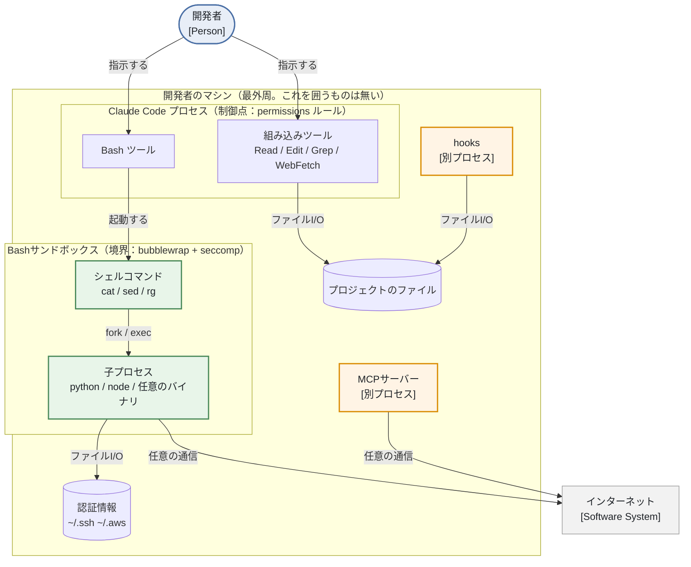
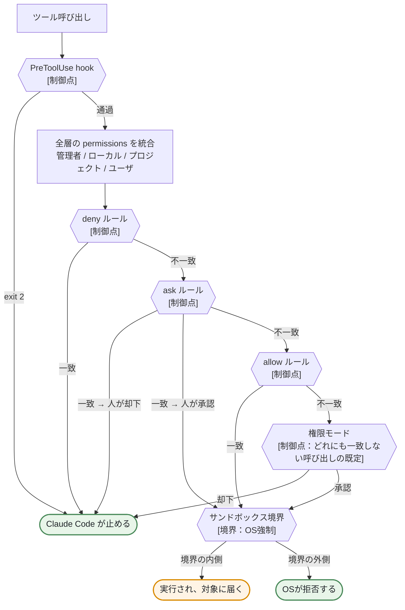
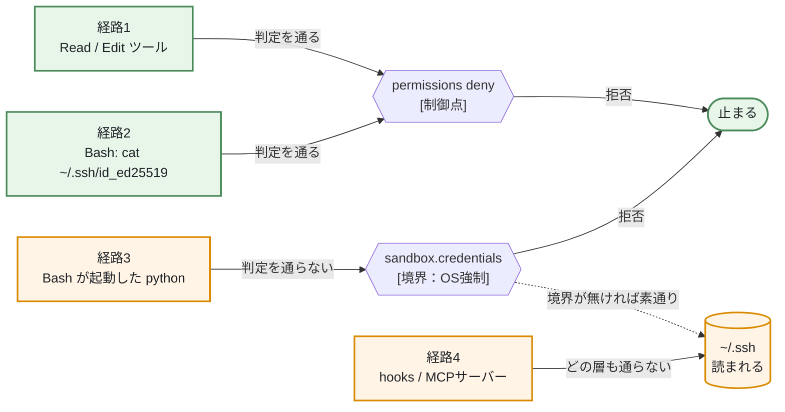
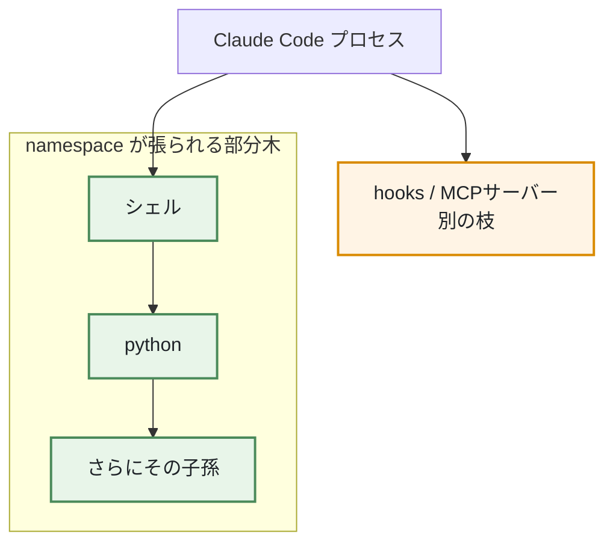
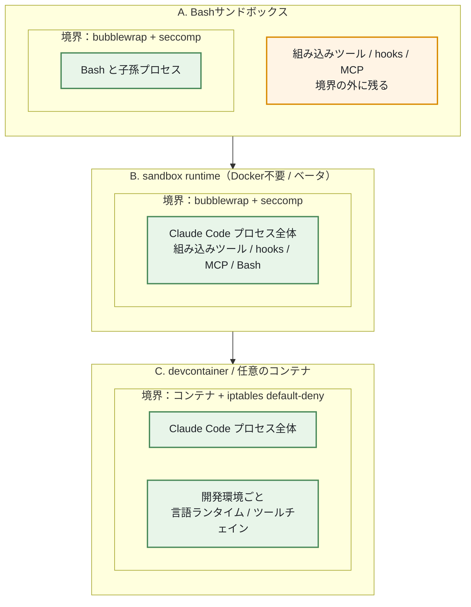
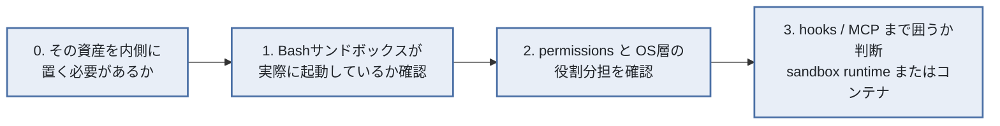

# 制御境界

最終更新: 2026-08-09

関連: [architecture.md](./architecture.md) / [design.md](./design.md)

---

## 0. この文書の範囲

Claude Code を使う際に**設定できる制御境界にはどんな種類があり、それぞれ何を止められるのか**を整理する。設定を見直すときの参照先として使う。

| 節 | 答える問い |
|---|---|
| §1 | 制御の層はいくつあり、それぞれ何を囲っているか |
| §2 | 1回のツール呼び出しは、どの順で判定されるか |
| §3 | 1つのファイルへの経路は、どの層で止まるか |
| §4 | 境界を広げる手段はどう違うか。広げられないときに何が残るか |
| §5 | 権限モードと隔離はどういう関係か |
| §6 | どの順で見直すか |

**設定値そのものはここに書かない。** `.claude/settings.json` と `~/.claude/settings.json` を正とする。転記すれば片方が必ず古くなる。ここに置くのは、設定ファイルを読んでも分からない「その設定がどの層に効くのか」だけである。

図中の記法は2種類。`境界` はそこを越えるアクセスを止められる仕組みで、プロセスツリー全体に効く。`制御点` は個別のアクションごとに可否を判定する仕組みで、判定を通る呼び出しにしか効かない。**この違いが、以降のすべての判断の分かれ目になる。**

図の描画のされ方は [architecture.md](./architecture.md) §0 と同じ扱いになる。

---

## 1. 制御の層

**橙色の hooks と MCPサーバーは、どの境界にも囲まれていない。** どちらも Claude Code とは別のプロセスとしてホスト上で動く。緑色の Bash 配下だけが境界の内側にある。

**この図は層の種類を示すものであり、このリポジトリの実際の配置ではない。** ここでは Claude Code プロセスごと devcontainer の内側で動かすため（§4 の C / ADR-0007）、hooks・MCPサーバーもファイアウォールの内側に入る。ただしコンテナが効くのは「ホスト側の資産がそこに存在しない」という形であって、**コンテナの中に置いた資産に対しては層にならない。** 内側の資産を守る話は §3 以降が扱う。

| 層 | 何を囲うか | 何を止められないか |
|---|---|---|
| permissions ルール | 組み込みツールの呼び出し。Bash のコマンド文字列 | コマンドが起動した先のプロセスの振る舞い |
| Bashサンドボックス | Bash とその子孫プロセス全部。OSが強制する | hooks・MCPサーバー・組み込みツール |
| 実行ユーザ | uid の境界 | 同じ uid で動くもの同士は区別できない |
| コンテナ / VM | Claude Code プロセスごと全部 | — |

permissions ルールは Bash に書かれた `cat` や `sed` も判定する。ただし判定できるのは**コマンド文字列として読み取れる範囲**であり、起動した先のプロセスが内部で何を開くかまでは追えない。

---

## 2. 1回のツール呼び出しが通る順序

§1 の層は同時に効くのではなく、決まった順で並んでいる。**どこで止まったかによって、止めた主体が Claude Code なのか OS なのかが変わる。**

**`ok` を橙色にしてあるのは、ここが「守られていない状態」だからである。** 上流のどの制御点にも引っかからず、境界の内側でもある呼び出しが対象に届く。図の他の終端は止まった状態を表す。

| 段階 | 判定するもの | 誤解しやすい点 |
|---|---|---|
| PreToolUse hook | 任意のシェルコマンドの終了コード | hook が「許可」を返しても deny・ask ルールは効き続ける。hook は止める側にしか足せない |
| deny → ask → allow | ルールのパターン一致 | 順序は固定で、**パターンの具体性は順序を変えない** |
| 権限モード | どのルールにも一致しなかった呼び出し | モードは既定値であり、ルールを上書きするものではない |
| サンドボックス境界 | プロセスが実際に触るファイル・通信先 | 上の3段はすべて Claude Code が判定する。ここだけが OS の強制 |

**deny → ask → allow の順序は、「広いルールが狭いルールに勝つ」ことを意味する。** 広い deny を1つ置くと、それに含まれる狭い allow はすべて無効になる。deny に例外を持たせることはできない。ask と allow の間も同じで、ask に一致した対象は、より具体的な allow を書いても必ず聞かれる。**ガードレール類を `deny` ではなく `ask` に置く設計は、この非対称性の上に成り立っている。**

### 層はどう合成されるか

**permissions のルールだけ、他の設定と合成のされ方が違う。**

| | 層が食い違ったとき |
|---|---|
| 通常の設定値 | 強い層が弱い層を**上書きする**。管理者 > コマンドライン引数 > ローカル > プロジェクト > ユーザ |
| permissions のルール | 上書きしない。**全層のルールを1つに統合してから** deny → ask → allow の順で判定する |

したがって、ユーザ設定の deny はプロジェクト設定の allow に勝ち、その逆も成り立つ。**「強い層で許可すれば弱い層の禁止を外せる」という関係は permissions には無い。** どの層であれ、一度 deny に入れた対象は他のどこからも開けられない。

管理者設定だけは別格で、permissions のルールに限らずコマンドライン引数でも上書きできない。個人の開発機ではこの層は空であることが多いが、**空であること自体が「上に誰もいない」という §1 の最外周の話とつながる。**

なお、合成の順序に乗る前に**そもそも読まれない**設定がある。置いた層によって有効・無効が変わるもので、これは §5 で扱う。

### 境界が制御点を肩代わりする唯一の場所

サンドボックスが有効なとき、Bash ツール全体に掛けた ask は**プロンプトを出さなくなる**（`autoAllowBashIfSandboxed` の既定）。境界の内側で動く以上、1回ずつ聞く意味が薄いという判断である。ただし肩代わりされるのはツール全体に掛けた ask だけで、次の3つは残る。

- コマンドの内容まで指定した ask（`Bash(git push:*)` の形）
- 明示的な deny
- `/` やホームディレクトリを対象にした `rm` 系

**肩代わりが起きるのは、実際にサンドボックスを通る呼び出しだけである。** サンドボックスから除外したコマンドや、境界が起動していない機械での実行には、ツール全体に掛けた ask がそのまま効く。制御点を境界に預ける設定である以上、預け先が動いていることを先に確かめる必要がある（§6 の段階1）。

---

## 3. 1つのファイルへの4つの経路

`~/.ssh` を例に、どの経路がどこで止まるかを示す。橙色は止まらない経路である。

**経路3が、Linuxのファイルパーミッションでは塞げない理由。** Claude Code が起動する Python は利用者と同じ uid で動く。パーミッションビットは uid 単位の判定なので、「同じユーザの、信頼できるプロセスとできないプロセス」を区別する語彙を持たない。`chmod 600` は他人からは守るが、自分自身のプロセスからは守らない。

塞ぐには**プロセスツリーに境界を引く**必要がある。それが namespace であり、`sandbox.credentials` はその層に乗る。

**プロセスツリーとは、プロセスの親子関係が作る木構造である。** プロセスは既存のプロセスが fork / exec することでしか生まれず、生成した側が親、生成された側が子になる。Claude Code が Bash ツールのシェルを起動し、そのシェルが python を起動すれば、3つは1本の系統としてつながる。hooks や MCPサーバーも Claude Code から起動されるが、Bash の下ではなく別の枝に生える。

子は親の実行環境を引き継ぐ。uid も、そして namespace も引き継がれる。**uid は木全体で同じ値になるため、木のどのノードかを区別する語彙にならない。** これが `chmod` で経路3を塞げない理由である。対して namespace は木の途中のノードに張ることができ、そこから下の部分木だけに別の見え方（見えるファイルシステム、使えるネットワーク）を与える。

この単位の違いが、そのまま §1 の表の「囲うもの」と「止められないもの」の切れ目になる。Bash のシェルに namespace を張れば、その子孫が何段深くなっても引き継がれるので `python` も `任意のバイナリ` も内側に入る。一方、別の枝にいる hooks・MCPサーバーには届かない。**境界の単位はプロセス個体ではなく部分木である。**

**経路4はどの層でも止まらない。** hooks と MCPサーバーを囲うには、Claude Code プロセス自体を境界の内側に入れるしかない（§4）。

実行ユーザを分ければ経路3・4とも塞げる。ただし git の設定・ssh-agent・各種CLIの認証・パッケージキャッシュがすべて別ユーザ側になるため、単独の開発環境では割に合わないことが多い。**userns を要さないため、この手段だけは bubblewrap が動かない機械でも成立する。**

### この機械での実測（2026-08-16）

上の図は一般論ではなく、ここでは測って確かめた結果である。

| 経路 | 結果 |
|---|---|
| 経路1（Read / Edit） | deny が効く |
| 経路3（Bashが起動した `python3`） | **deny 対象のパスを開いて内容が返る** |
| 経路3のうち外向き通信 | 許可リスト外は到達不可。`api.anthropic.com` のみ到達可 |

経路3を塞ぐ `sandbox.credentials` は bubblewrap の上に乗るが、`unshare -Urm` が `Operation not permitted` を返す。`kernel.apparmor_restrict_unprivileged_userns=1` はカーネル全体に効き、コンテナのプロセスは `docker-default` プロファイル下にあるため、**devcontainer の内側でも起動できない**（ADR-0007 / ADR-0012）。

したがってここでの経路3は、塞ぐのではなく**読まれて困るものを内側に置かない**ことで扱っている（§4）。到達先が `api.anthropic.com` に限られることは、持ち出しを防ぐ一方で、読まれた内容がモデルの文脈へ載ることは防がない。

---

## 4. 境界を広げる手段

囲う範囲で3段階ある。下にいくほど広く、構築の手間も増える。

| | 囲う範囲 | Docker | ネットワーク遮断の効き方 |
|---|---|---|---|
| A. Bashサンドボックス | Bash と子孫のみ | 不要 | Claude Code のプロキシ経由。サンドボックスを通る通信だけ |
| B. sandbox runtime | プロセス全体 | 不要 | 同上。ただし hooks・MCP も境界内に入る |
| C. コンテナ | 開発環境ごと | 必要 | iptables の default-deny。コンテナ内の全プロセス・全経路 |

**B は A と同じ bubblewrap を使う。** A が起動できない環境では B も動かない。囲う範囲を広げる前に、A が実際に起動しているかを確かめる必要がある。

**C を選ぶ判断軸は、遮断を設定ではなくネットワーク層で担保したいかどうか。** A と B の遮断は Claude Code のプロキシに依存するため、境界の外で動くプロセスには効かない。コンテナの iptables はコンテナ内のすべての経路に効く。代償として、開発環境一式をイメージに載せる手間と、重いローカル資産（モデルの重みなど）を抱える場合のサイズが問題になる。

**default-deny は、例外を1つ作るたびに穴になりうる。** 名前解決のために開けた53番は、そのままIP許可リストを通らない持ち出し経路になる（ADR-0007の追記）。**「何を許可したか」ではなく「その許可で何ができるか」で読む必要がある。**

**そして、例外を狭めても穴が閉じるとは限らない。** 53番の宛先を既定のリゾルバへ限定しても、リゾルバは再帰問い合わせを行うため、攻撃者のドメイン配下の名前を引くだけでクエリ名が相手の権威サーバへ届く。**許可した宛先が、その先へ中継する種類のサービスかどうかまで見る必要がある。** 中継するなら、宛先を絞っても経路は残る。

ここでの判断は、**塞げない制限は持たず、限界として書く**である。半端な制限は「塞げているつもり」を生み、§6 の段階1が名目化するのと同じ結果を招く。

### 囲う代わりに、置かない

A〜C は「境界をどこまで広げるか」の話であり、囲う層が起動しない機械では上限がある。これに対して、**囲えないなら囲う必要のあるものを内側に置かない**という手段が直交して存在する。

| | 効く経路 | 成立の前提 |
|---|---|---|
| A〜C（囲う） | 境界の内側に入れた範囲 | その境界が実際に起動すること |
| 置かない | 経路1〜4のすべて | その資産をその環境で使わずに済むこと |

これは制御点でも境界でもなく、**守る対象そのものを消す**ことで成立する。層が1つも動かない環境でも効き、判定の抜けが原理的に無い。代償は、その資産を使う作業がその環境でできなくなることであり、成立するかどうかは資産ごとの分類で決まる（ADR-0012）。

---

## 5. 権限モードと隔離の関係

この2つは別物であり、片方がもう片方を代替しない。§2 の図でいえば、権限モードは上流の制御点の1つ、隔離境界は最下流にある。

権限モードは**実行するかどうか**を決め、隔離境界は**実行された後に届く範囲**を決める。したがってモードを緩めるほど、境界の位置が効いてくる。

| モード | 隔離境界 | 理由 |
|---|---|---|
| `auto` | **必須ではない** | 分類器がアクションごとに審査する。境界は多層防御として足す |
| `bypassPermissions` / `--dangerously-skip-permissions` | **必須** | 止める仕組みが境界しか残らない |

**「コンテナを入れれば auto モードが安全になる」という関係ではない。** auto モードは分類器という制御点を持つので、設計上は境界なしで成立する。境界が前提条件になるのは bypassPermissions のほうである。

auto モードの分類器が既定で拒むものには、外部エンドポイントへの機微データ送信、`curl | bash` 形式のダウンロード実行、force push、セッション開始後に追加された git リモートへの操作が含まれる。

**設定ファイルの層と、効く範囲が一致しない設定がある。** `defaultMode` の `auto` と `sandbox.network.strictAllowlist` は、プロジェクト設定に書いても無視される。リポジトリが自分自身に権限を与えることを防ぐ仕様で、どちらもユーザ設定か管理者設定に置く必要がある。設定を見直す際は、値が正しいかだけでなく**置いた層で有効になるか**を確認する。

---

## 6. 見直しの順序

設定値を足す前に、その設定が乗る層が動いているかを先に確かめる。動いていない層に正しい値を書いても効果はなく、守れているという誤解だけが残る。

| 段階 | 確かめること | 満たせないと |
|---|---|---|
| 0 | その資産をこの環境で使うのか | 置かずに済むものについて、塞げない層の議論を続けることになる |
| 1 | `/sandbox` で境界が有効になっているか | OS層の設定がすべて名目上のものになる |
| 2 | permissions で塞いだ対象が、OS層でも塞がれているか | §3 の経路3 が開いたままになる |
| 3 | hooks・MCPサーバーを境界内に入れる必要があるか | §3 の経路4 が開いたままになる |

**段階0を先に置くのは、ここで外せた資産には以降の段階が要らないからである。** 層を1つ増やす判断より、対象を1つ減らす判断のほうが安く、確実に効く。

段階3は段階1と2の結果を見てから判断する。囲う範囲を広げるほど構築と運用の手間が増えるため、経路4 を閉じる必要が本当にあるかどうかが分かれ目になる。
